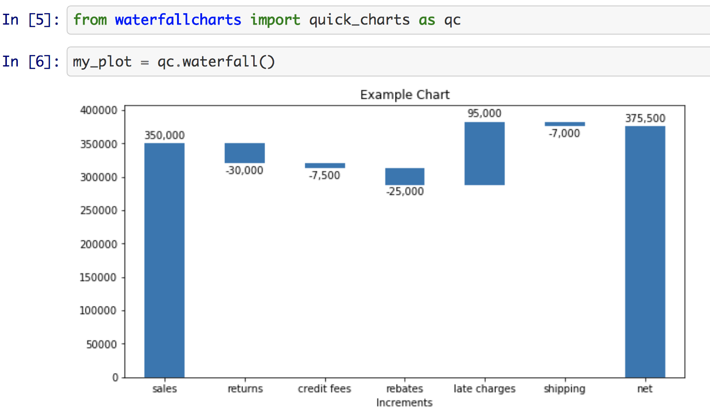

!! This is a work in progress package !!

Waterfall_charts attempts to provide an easy and quick way to plot basic (for now) and more advanced (to come) waterfall charts of the accounting and finance type.



## Guide

```bash
pip install waterfallcharts
```

to your file imports add from waterfallcharts import quick_charts as qc , for example

## Usage

As detailed in the [example](https://github.com/chrispaulca/waterfall/blob/master/packageTest.ipynb) and source code, the function assumes two list inputs, one of the contribution NAMES and the other of the contribution AMOUNTS. Please note that the NET SUM of all contributions is not an input to the function, and is calculated for you.
